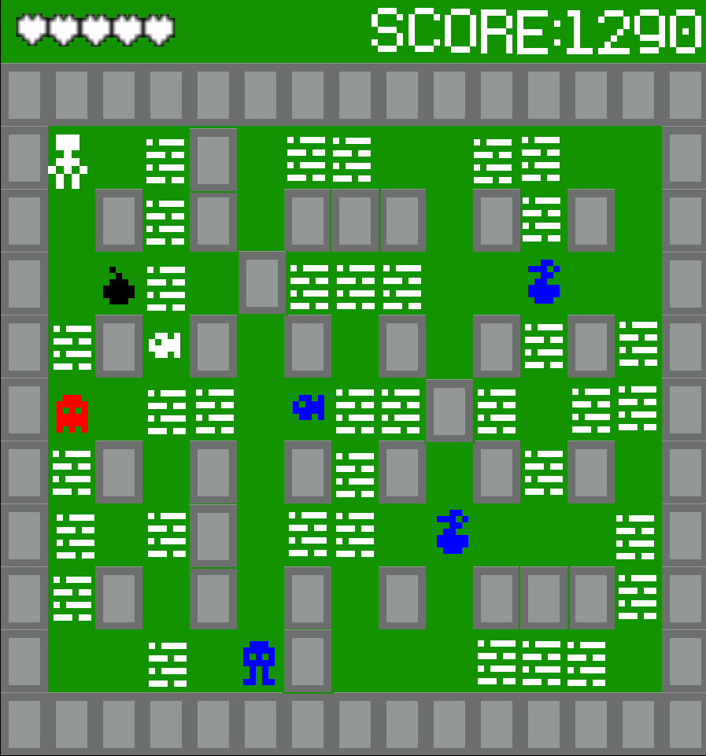
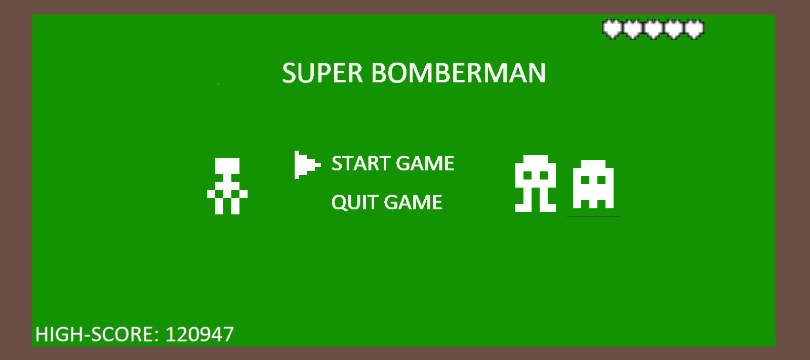
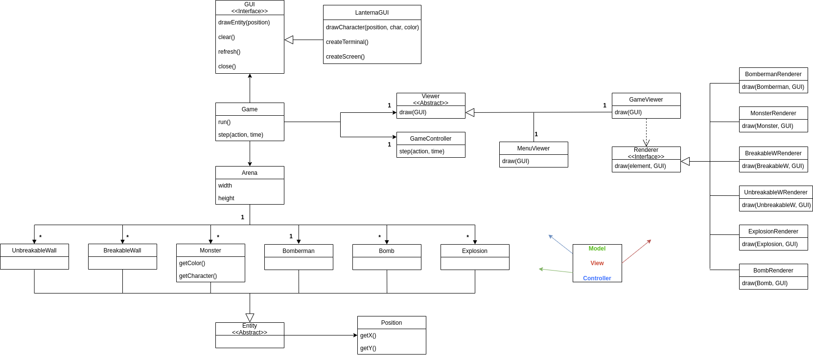
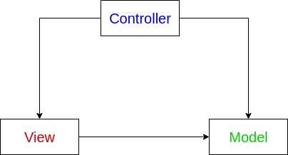
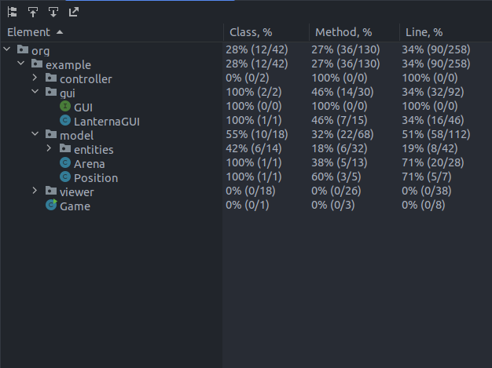

# LDTS_0102 - Super Bomberman

Neste jogo de estratégia jogas com um homem que está preso num labirinto! Coloca bombas cronometradas para matar os montros que encontras ao longo do caminho. Se eles forem apanhados na explosão da bomba, eles vão desaparecer! Também podes explodir paredes com as bombas, onde podes encontrar tesouros e a saída! Se acidentalmente a explosão passar no tesouro ou na saída, um monstro vai aparecer e vir atrás de ti!

Super Bomberman é um jogo com vários níveis, e onde te poderás superar a tentar utrapassar a tua melhor pontuação de outras partidas! Mata monstros, parte paredes, e diverte-te!

Este projeto foi desenvolvido por [António Azevedo](https://github.com/xubby), [José Martins](https://github.com/ZeAntonioM) e [Sérgio Peixoto](https://github.com/ShadowPT) para LDTS 2022/23

-----

MOCKUPS PLANEADOS E UML
-----

### Mockup da Arena

### Mockup da Menu

### UML

## FEATURES IMPLEMENTADAS

- **Arena e vários tipos de elementos** - Cada elemento desenhado na arena (excepto as explosões) tem o seu próprio caractér e consegue ser desenhado na arena.

## FEATURES PLANEADAS

- **Menu** - No menu o jogador poderá escolher se quer começar o jogo, sair do jogo, poderá verificar a sua melhor pontuação (no canto inferior direito) e aparecerá de fundo alguns dos "personagens" do jogo.
- **Saida e Powerups aparecem ao explodir paredes** - Quando uma bomba colide com uma parede quebrável, corre um algoritmo que define se aparece um powerup ou a saída. Para aparecer a saída, definimos um algortimo que incrementa a possíbilidade de aparecer, que será 100% caso ainda nao tenha aparecido até a penúltima parede ser quebrada.
- **Explosões** - Quando o timer da bomba acaba, uma explosão ocorre e é renderizada. Para cada explosão, é verificado se ocorre alguma colisão com: Uma bomba ainda por explodir; Algum monstro; Com o Bomberman; Com a saida; Com os PowerUps; Com paredes quebráveis.
- **Sprites** - Para minimizar a noção de fps e para deixar mais bonito, planeamos implementar sprites para os personagens. Planeamos implementar através de matrizes RGB, que serão renderizadas para usar as Sprites.

## Padrão de arquitetura

**Contexto do problema** 

A arquitetura de um projeto é uma das escolhas mais importantes no desenvolvimento de um projeto, e tem de ser planeado desde o início, para haver organização e para ajudar na construção do mesmo.

No nosso projeto, é importante que se separem os dados, as interfaces e o controlo do jogo, para haver maior reutilização de código e para facilitar a implementação de novo código.
Com a solução que usamos, impedimos que seja quebrado o **Single Responsability Principle (SRP)**.

**Pattern utilizado**

Decidimos usar o método MVC como a arquitetura do nosso programa, visto ser o modelo mais viável para contrução e organização de código.

Neste método, o código é organizado em três elementos diferentes:
- **Model** : contém os dados do programa;
- **View** : contém as interfaces do programa; 
- **Controller** : Controla os dados e as interfaces.

**Implementação**

O método MVC é organizado da seguinte forma:

Como podemos verificar, o Model não tem dependências, o View depende do Model e o Controller depende do Viewer e do Model.

**Consequencias**

- Fácil de modificar;
- É melhor para testar;
- Como foi dito anteriormente, devido à separação em 3 elementos, a dependência do código está melhor estruturada;
- Alta coesão, ou seja, todo o código acaba por se relacionar, ainda que esteja separado entre os 3 elementos.

### CODE SMELLS RECONHECIDOS E SUGESTÕES DE REFACTORING

Graças ao uso da ferramenta Liveref, conseguimos minimizar estes problemas, tentando sempre seguir as sugestões de refactoring dadas pela ferramenta.
Assim, no momento, não encontramos nenhum Code Smell.

### TESTES

> Uma vez que apenas fizemos testes para a Arena e para a LanternaGUI, apenas colocamos na imagem as classes cobertas na testagem.
- [Link to mutation testing report](../build/reports/tests/test/index.html)

### AUTO-AVALIAÇÃO

- António Azevedo: 33.3%
- José Martins: 33.3%
- Sérgio Peixoto: 33.3% 